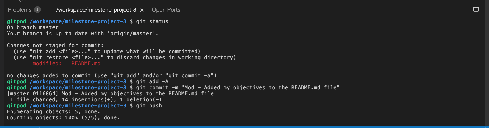

<h1 align="center">Milestone Project 3 - Home Cooking</h1>

[View project here](https://home-cooking-milestone3-proj.herokuapp.com/)

This interactive site is based around individuals who would like a place to keep their recipes all 
in one place as well as share it with the rest of the world. Being able to create new recipes, 
edit and delete recipes on demand from the computers to their mobile phones. They would have the chance to write 
down the ingredients needed and the steps required to make the specific dish. 
If any issues arise, they would have the chance to reach out to the site administrator by sending them an email. 

This site would be utilizing Python which was taught from the Code Institute as well as using MongoDB. 
I will be using various technologies as well such as HTML5, CSS3, JQuery and Materialize. 
This project will be responsive and accessible to different size browsers and devices.

<h2 align="center">

## User Experience (UX)

### The Audience

The intended audience for this project is all individuals, from students who are about to leave home for the first time to go 
to universities and want to write down Mums cooking, all way to individuals who like to experiment in the kitchen but need a 
place to remember what they have done.  

### User Objectives

To have a place to store customised recipes and for them to be accessed anywhere from any device. The user would be able to 
register to begin the journey of adding a recipe to their account. From there, they would be able to log in and create their recipe. 
They would be able to add the ingredients and steps taken to make their dish once saved. The user would have the option to edit, 
delete and even share their recipes because by default all recipes would be set to private. 

The user would be able to edit their recipes and if they are logged into their account. Users who do not have an account but can 
see shared recipes, will not be able to edit or amend recipes. If the user is trying to look for something, there would be search 
functionality for them to be able to search by ingredient or by the name of the dish. Once all is achieved, the user can log out. 
If the user is trying to look for something, there would be search functionality for them to be able to search by ingredient or 
by the name of the dish. Once all is achieved, the user can log out. 

### My Objectives

My objectives are going to be achieved by taking images from free image stock websites that would have images of recipes, meals and 
kitchen crockery that I want to advertise. The recipes and ingredients would be taken from other websites to use as the data being 
pulled from the database. The users would be able to contact the site admin if they have any queries or questions as it would 
incorporate a contact form that would be linked to a live email address. The site would have a registration form and a login/logout 
functionality to allow users to have their profiles. It would also have validation included with error messages if 
the username or password is wrong.

The site would have a CRUD software architectural style (Create, Read, Update and Delete) for basic operations of persistent storage 
with the recipes being added by the users. Validation would also be in this part of the site as only the recipe owner would be able 
to edit and share the specific recipe.

The navigation bar and footer would be built within the base file and the content for the rest of the site would be built within 
their specific .html files. Within the footer, there would be social media links which would connect the user to the sites alternative 
social platforms.

## User Stories

The intended type of users for which this site would be focused towards are individuals who would like to store their 
homemade recipes online

1. As a user,

## Design

-   #### Colour Scheme
    -   The colour scheme I will be working with is mainly white but with a touch of greasy of-white/cream colour 
    to portray cooking and grease as well as it is most commonly used for baking. The text colour will be black to keep 
    the text easy to read (Will be using WebAIM to check the contrast of the colour scheme).

-   #### Typography
    -   I have chosen to use [Merriweather](https://fonts.google.com/specimen/Merriweather) and [Heebo](https://fonts.google.com/specimen/Heebo) 
    font as the main fonts throughout the website with Sans Serif as the emergency font in the case for any reason 
    the font is not being imported into the site correctly. Both [Merriweather](https://fonts.google.com/specimen/Merriweather)
    and [Heebo](https://fonts.google.com/specimen/Heebo) are attractive fonts to use as it easy to clear and easy to read, they are also has a touch formality 
    without being formal.

-   #### Imagery
    -   The images that were used are based on the content of what it is portraying. Displaying ingredients, finished 
    meals and kitchen crockery without diverting them for the task they need to complete. 

*   ### Wireframes

    #### Home Page
    - Home Page Wireframe (Web Browser) - [View PDF]() | [View Image]()
    - Home Page Wireframe (Tablet) - [View PDF]() | [View Image]()    
    - Home Page Wireframe (Mobile) - [View PDF]() | [View Image]()

    #### Register Page
    - Register Page Wireframe (Web Browser) - [View PDF]() | [View Image]()
    - Register Page Wireframe (Tablet) - [View PDF]() | [View Image]()    
    - Register Page Wireframe (Mobile) - [View PDF]() | [View Image]()

    #### Login Page
    - Login Page Wireframe (Web Browser) - [View PDF]() | [View Image]()
    - Login Page Wireframe (Tablet) - [View PDF]() | [View Image]()    
    - Login Page Wireframe (Mobile) - [View PDF]() | [View Image]()

    Master Wireframe
    - Master Wireframe - [View]()
    
## Features

The features that will be utilised in this project will be as follows:

### Existing Features

## Technologies Used

###  Programming Languages Used

-   [HTML5](https://en.wikipedia.org/wiki/HTML5)
    - HTML5 was used to structure and present content on my website.
-   [CSS3](https://en.wikipedia.org/wiki/Cascading_Style_Sheets)
    - CSS3 was used to provide my website with style.
-   [JavaScript](https://en.wikipedia.org/wiki/JavaScript)
    - JavaScript was used to make the site interactive.
-   [Python](https://en.wikipedia.org/wiki/Python_(programming_language))
    - Python was used as the backend language to access and parse data.

### Databases, Frameworks, Libraries, Programs and Templates Used

#### Databases
1. [Mongodb:](https://www.mongodb.com/)
    - Database which stores the data to be recalled onto the website.

#### Frameworks
1. [Materialize:](https://materializecss.com/)
    - Responsive front-end framework to assist with the responsiveness and styling of the website.
1. [JQuery Core 3.6.0:](https://code.jquery.com/)
    - JQuery library was implemented to use features within Materialize

#### Library
1. [Google Fonts:](https://fonts.google.com/)
    - Google fonts were used to import the font into the style.css file which is used on all pages throughout the project.
1. [Font Awesome 5.13.3:](https://cdnjs.cloudflare.com/ajax/libs/font-awesome/5.15.3/css/all.min.css)
    - Font Awesome was used on all pages throughout the website to add icons for aesthetic and UX purposes.

#### Programs
1. [Grammerly:](https://app.grammarly.com/)
    - Online tool which assists with the English grammar.
1. [GitHub:](https://github.com/)
    - GitHub is used to store the code of the project after being pushed from GitPod.
1. [GitPod:](https://www.gitpod.io/)
    - A cloud development environment that allows us to create the website.
1. [Google Chrome:](https://www.google.co.uk/intl/en_uk/chrome/)
    - Default browser used to visually display the build process as well as utilising Chrome Dev Tools to assist where needed.
1. [Balsamiq:](https://balsamiq.com/)
    - Balsamiq was used to create the [wireframes](#) during the design process.
1. [RandomKeygen:](https://randomkeygen.com/)
    - A tool to randomly generate a password.
1. [Heroku:](https://www.heroku.com)
    - A platform as a service (PaaS) that enables me to deploy my website in the cloud.

#### Templates

1. [Github Code Institute Template:](https://github.com/Code-Institute-Org/gitpod-full-template)
    - A template provided by the Code Institute which has the preinstalled tools that will get us started.

## Testing

### Validation

#### Results

### Further Testing

#### User Stories Testing from User Experience (UX) Section - [View Results](#)

#### Functionality and Usability Testing - [View Results](#)

#### Browser and Responsive Testing

### Known Issues

## Deployment

### Making a Clone

To make a clone, I used the [Code Institute Template](https://github.com/Code-Institute-Org/gitpod-full-template) that was provided and from there, I download the 
[GitPod extension](https://www.gitpod.io/docs/browser-extension/) to be able to direct me to the cloud development tool.

When using GitPid, whenever code was created and saved, I would use the terminal to push it to GitHub by using the following commands:
1. git status (to check what needs to be pushed to GitHub)
1. git add -A
1. git commit -m "[Comment]"
1. git push

## Credits

### Content

### Code

### Media

### Acknowledgements

