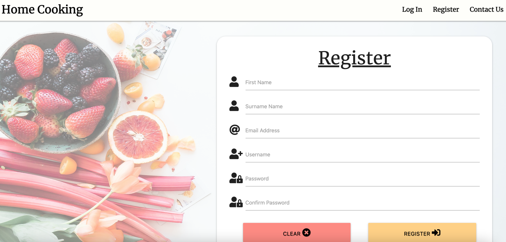
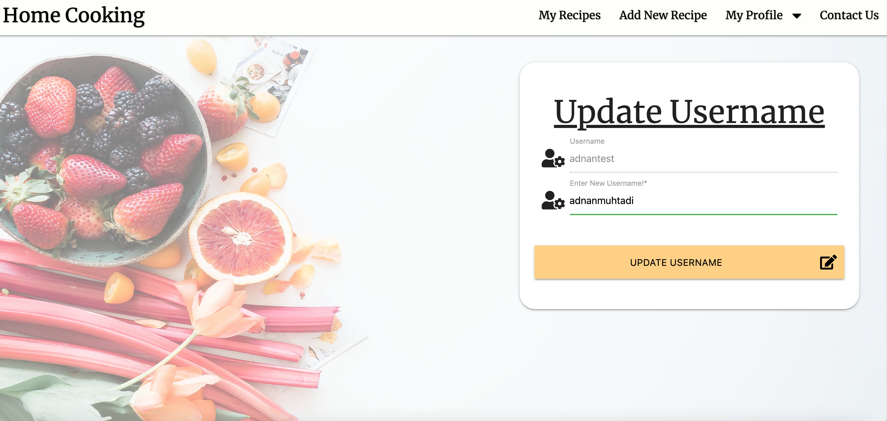
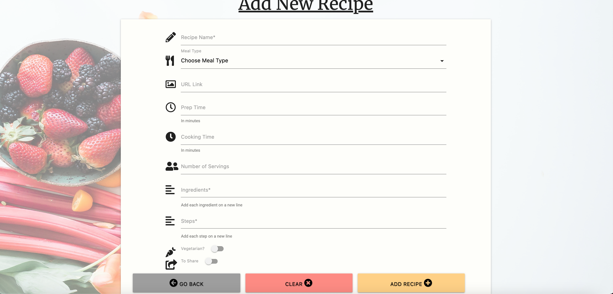
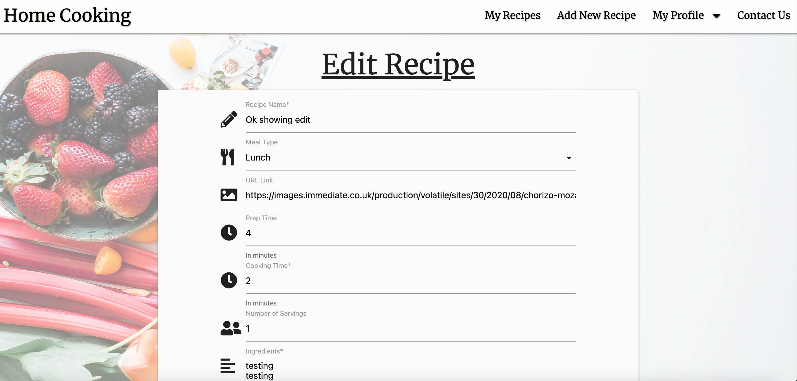
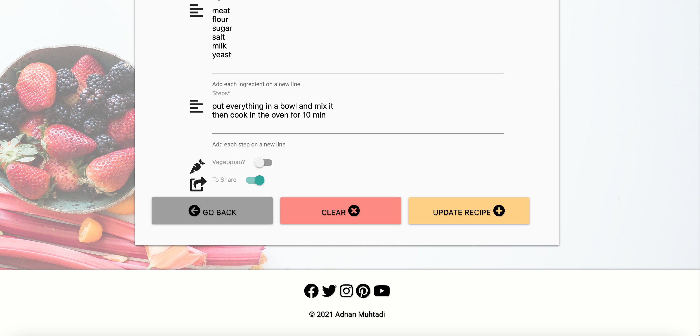
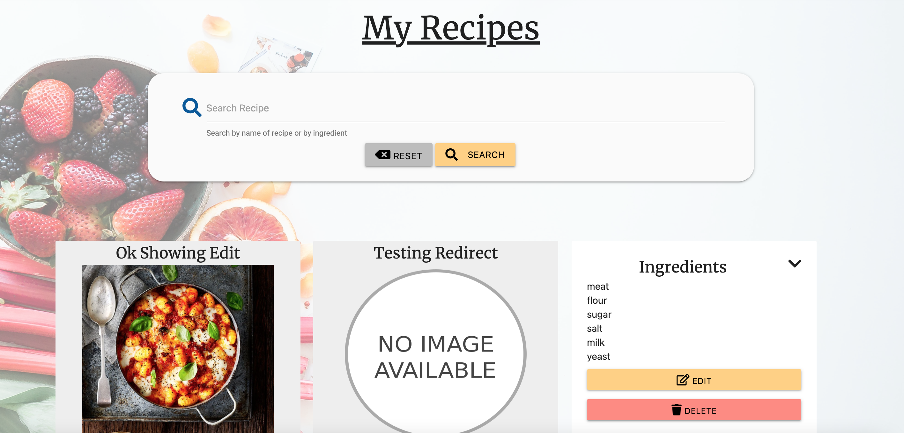
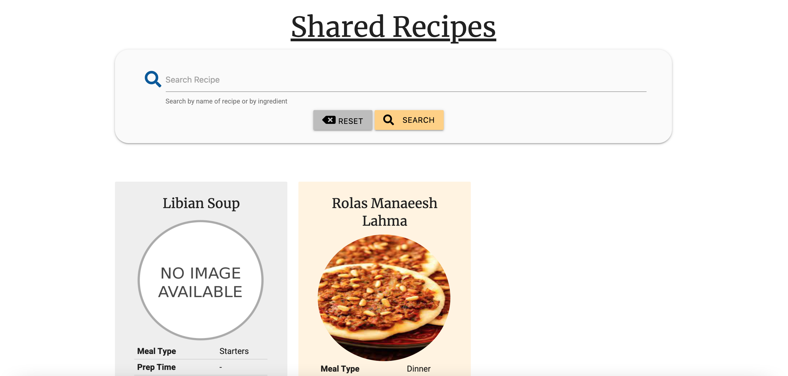
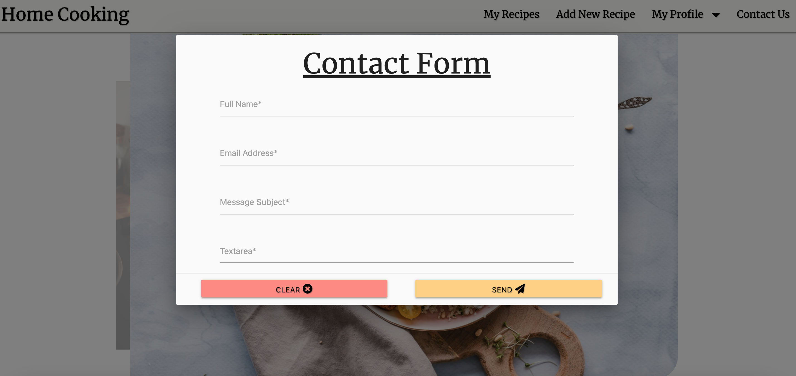
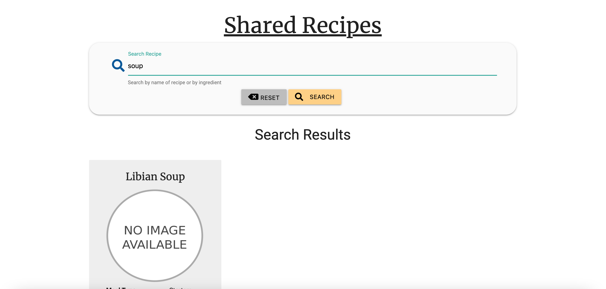
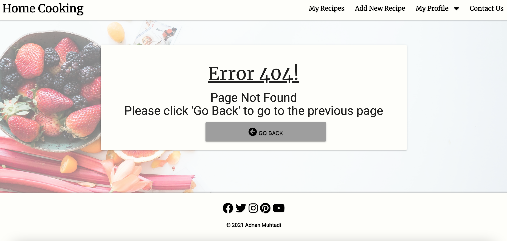

<h1 align="center">User Story Testing</h1>

- As a user, I want to be able to register to the website so I can have my own profile.
    1. Upon entering the site, the navigation bar will have have 'Register'.
    1. Once clicked, a registration would appear.

- As a user, I want an error message to appear if I typed my username/password incorrectly so I can attempt again with the correct username/password.
    1. Upon entering the site, the navigation bar will have have 'Login'.
    1. Once clicked, the login page would be loaded.
    1. Enter the wrong username.
    1. Once click on 'Log In'
    1. An error message would appear.

    OR

    1. Upon entering the site, the navigation bar will have have 'Login'.
    1. Once clicked, the login page would be loaded.
    1. Enter the wrong password.
    1. Once click on 'Log In'
    1. An error message would appear.

- As a registered user, I want to be able to edit my username and/or password so I can update my profile.
    1. Upon entering the site, the navigation bar will have have 'Login'.
    1. Once clicked, the login page would be loaded.
    1. Once logged in, hoover over 'My Profile' and you can see 'Edit Username' and/or 'Edit Password'. 
    1. Once on the 'Edit Username' and/or 'Edit Password, Enter your new username.
    1. Once you click on 'Update', you would be logged out to enter with your new credentials.  

- As a registered user, I want to be able to create and save a recipe so I view it whenever I want.
    1. Upon entering the site, the navigation bar will have have 'Login'.
    1. Once clicked, the login page would be loaded.
    1. Once logged in, from the navigation bar, click on 'Add New Recipe'.
    1. Once saved, the recipe would be saved in 'My Recipes'.

- As a user, I want to be able to edit my recipes so I can amend them if I made a mistake.
    1. Upon entering the site, the navigation bar will have have 'Login'.
    1. Once clicked, the login page would be loaded.
    1. Once logged in, you would be directed to 'My Recipe' page.
    1. click on the '^' arrow, then select on 'Edit'.

- As a registered user, I want to be able to share my recipe so I can allow other non registered users to see my meal
    1. Upon entering the site, the navigation bar will have have 'Login'.
    1. Once clicked, the login page would be loaded.
    1. Once logged in, from the navigation bar, click on 'Add New Recipe'.
    1. Scroll down to the bottom of the page till you see the 'To Share' toggle.
    1. Once the toggle has been switch on, and click on save. Click the home page.
    1. Scroll down to the bottom of the page to see the recipes that have been shared.

- As a registered user, I want to be able to delete a saved recipe so I can remove it from the list of saved recipes.
    1. Upon entering the site, the navigation bar will have have 'Login'.
    1. Once clicked, the login page would be loaded.
    1. Once logged in, you would be directed the 'My Recipe' page.
    1. click on the '^' arrow, then select on 'Delete'.

- As a registered user, I want to be able to tell the difference between which recipes have been created by me vs recipes created by other users so I can know which ones I have shared.
    1. Upon entering the site, the navigation bar will have have 'Login'.
    1. Once clicked, the login page would be loaded.
    1. Once logged in, you would be directed the 'My Recipe' page.
    1. Click on the home page and scroll down to the bottom of the page.
    1. The recipes that have been shared by you would be in a light orange colour.

- As a user, I want to be to send an email to the site admin so I can contact them if I have any issues.
    1. Upon entering the site, the navigation bar will have 'Contact Us'.
    1. Once clicked on, a modal would appear which requires you to fill a form.
    1. Once filed out, click on 'Send'

- As a user, I want to be able to search for recipes so i can filter what i am looking for.
    1. Upon entering the site, the navigation bar will have have 'Login'.
    1. Once clicked, the login page would be loaded.
    1. Once logged in, you would be directed the 'My Recipe' page.
    1. Enter in the search bar either a name of a recipe or an ingredient.
    1. Once you click on search, the page would reload with the results that appears from your search.

- As a user, I want to see an error page if I enter the wrong extension page within the URL so I know I am in the wrong location.
    1. Upon enter the site, add an 's' to the end of the URL.
    1. A 404 error page would appear.

[Return to main README.md](https://github.com/adnanmuhtadi/milestone-project-3)